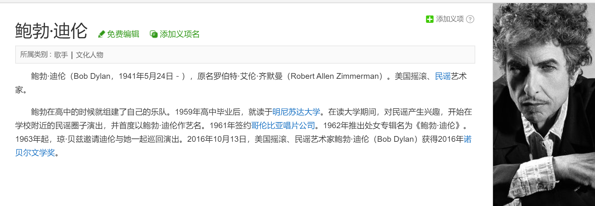
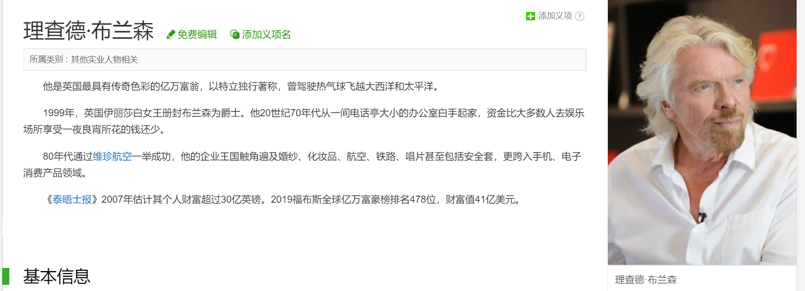
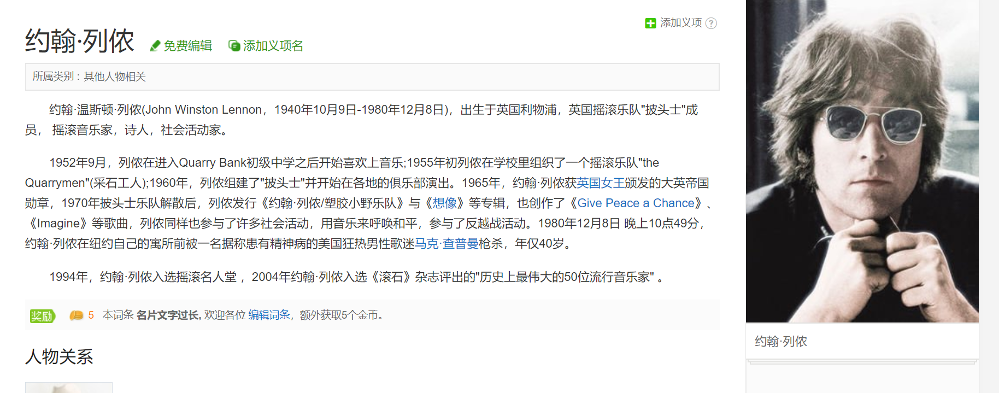
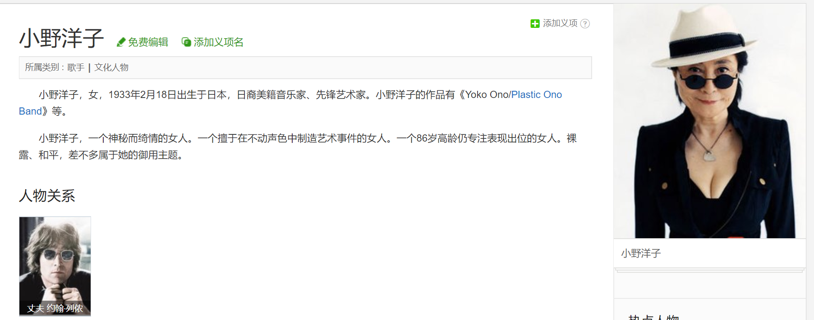

## Celebrities

## Fang

## Zhang

### Gandhi

**Mahatma Gandhi**, [Indian](https://www.britannica.com/topic/history-of-India) lawyer, politician, social activist, and writer *who became the leader of the nationalist movement against the British rule of [India](https://www.britannica.com/place/India)*. [[张依纯1\]](#_msocom_1) As such, he came to be considered the father of his [country](https://www.britannica.com/topic/nation-state). [Gandhi](https://www.britannica.com/topic/Gandhi) is internationally esteemed for his *doctrine of [nonviolent protest](https://www.britannica.com/topic/nonviolence)[[张依纯2\]](#_msocom_2)* to achieve political and social progress.

Gandhi was quickly exposed to the racial [discrimination](https://www.merriam-webster.com/dictionary/discrimination) practiced in South Africa. In a [Durban](https://www.britannica.com/place/Durban) court he was asked by the European magistrate to take off his turban; he refused and left the courtroom. A few days later, while traveling to [Pretoria](https://www.britannica.com/place/Pretoria), he was unceremoniously thrown out of a first-class railway compartment and left shivering and brooding at the rail station in [Pietermaritzburg](https://www.britannica.com/place/Pietermaritzburg). In the further course of that journey, he was beaten up by the white driver of a stagecoach because he would not travel on the footboard to make room for a European passenger, and finally he was barred from hotels reserved “for Europeans only.” Those humiliations were the daily lot of Indian traders and labourers in Natal, who had learned to pocket them with the same resignation with which they pocketed their meagre earnings. *What was new was not Gandhi’s experience but his reaction.[[张依纯3\]](#_msocom_3)* He had so far not been [conspicuous](https://www.merriam-webster.com/dictionary/conspicuous) for self-assertion or aggressiveness. But something happened to him as he smarted under the insults heaped upon him. In retrospect the journey from Durban to Pretoria struck him as one of the most-creative experiences of his life; *it was his moment of truth. Henceforth he would not accept injustice as part of the natural or unnatural order in South Africa; he would defend his dignity as an Indian and as a man.*

 ### Amelia

**Amelia Earhart** was an American aviation pioneer and author. Earhart was *the first female aviator to fly solo across the Atlantic Ocean.* She set many otherrecords, wrote bestselling books about her flying experiences, *and was instrumental in the formation of The Ninety-Nines, an organization for female pilots.*

 ### Hitchcock

**Alfred Hitchcock**,known as the *"Master of Suspense"*,was an English film director, producer and screenwriter. He is one of the most influential and extensively studied filmmakers in the history of cinema.

Hitchcock’s greatest gift was his mastery of the technical means to build and maintain suspense. To this end he used innovative camera viewpoints and movements, elaborate editing techniques, and effective soundtrack music. He had a sound grasp of human [psychology](https://www.britannica.com/science/psychology).

### Martha Graham

As a child, **Martha Graham** was influenced by her father, a doctor who used physical movement to remedy nervous disorders. Throughout her teens, Graham studied dance in Los Angeles at Denishawn. In 1926, she established her own dance company in New York City and *developed an innovative, non-traditional technique* that spoke to more *taboo forms of movement and emotional expression*. She danced well into her 70s and choreographed until her death in 1991, leaving the dance world forever changed.

*Despite the fact that many early critics described her dances as “ugly,”* Graham’s genius caught on and became increasingly respected over time, and her advances in dance are considered by many to be an *important achievement in America’s cultural history.* The Graham technique is a highly regarded form of movement taught by dance institutions across the globe. 

------

[1] Push human race forward

[2] Genius

[3] Refuse to obey the rules and show no respect for status quo, rebels

## Yan

- [Jim Hension](jimhension.html)
- [吉姆·亨森](hension-zh.html)
- [Kermit the Frog](kermit.html)
- [大青蛙科米](kermit-zh.html)
- [Frank Lloyd Wright](frank.html)
- [弗兰克·劳埃德·赖特](wright-zh.html)
- [Pablo Picasso](picasso.html)
- [毕加索](picasso-zh.html)

## 玛莎·葛兰姆（Martha Graham）

玛莎·葛兰姆，又译为马莎·格雷厄姆，美国舞蹈家 和编舞家，也是现代舞蹈史上最早的创始人之一。

## [玛莎·葛兰姆 | 现代舞之母](https://zhuanlan.zhihu.com/p/86540602)

***现代舞之母——玛莎·葛兰姆是二十世纪最伟大的艺术家之一，与斯特拉文斯基、毕加索齐名为二十世纪世界三大艺术巨匠。***

